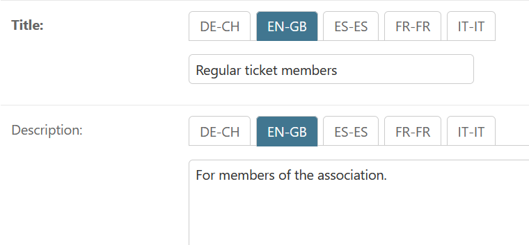

# django-modeltrans-tabs

Adds a tabbed UI to [`django-modeltrans`](https://github.com/zostera/django-modeltrans/) translation fields in the Django Admin.

<picture>
  <source media="(prefers-color-scheme: dark)" srcset="img/modeltrans_tabs_dark.png">
  <source media="(prefers-color-scheme: light)" srcset="img/modeltrans_tabs_light.png">
  
</picture>

## Installation

Use your preferred package manager:

```bash
pip install django-modeltrans-tabs
```

## Setup

Just two steps to enable. First, update your `settings.py`:

```py
INSTALLED_APPS = [
    # Ensure staticfiles is installed
    "django.contrib.staticfiles",
    #
    # Add modeltrans-tabs:
    "modeltrans_tabs",
]
```

Then, inherit the mixin from your `ModelAdmin`:

```py
from modeltrans_tabs.admin import TabbedLanguageMixin


class MyModelAdmin(TabbedLanguageMixin, admin.ModelAdmin):
    ...

```


## Usage

By default, the admin mixin will modify your fieldset to incorporate your translated fields. No changes are required in this case.

If you use a customized fieldset on your `ModelAdmin`, you will need to update the field list to include all languages for a translated field as a tuple.

This uses the Admin's feature to show multiple fields in the same row. Note that you do not include the `field_i18n` variant.


Using the `i18n_fields` helper method:

```py
class MyModelAdmin(TabbedLanguageMixin, admin.ModelAdmin):
    def get_fieldsets(self, request, obj=None):
        return (
            (
                None,
                {
                    "fields": (
                        "normal_field",
                        self.i18n_field("translated_field"),
                    ),
                }
            )
        )
```

Or manually:

```py
class MyModelAdmin(TabbedLanguageMixin, admin.ModelAdmin):
    fieldsets = (
        (
            None,
            {
                "fields": (
                    "normal_field",
                    (
                        "translated_field", 
                        "translated_field_de", 
                        "translated_field_fr", 
                        "translated_field_it",
                    ),
                ),
            }
        )
    )
```